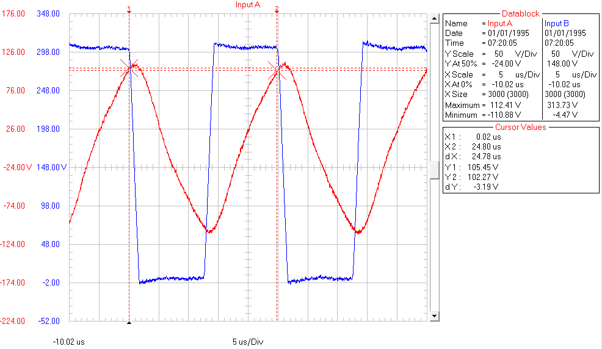

## Introduction

This repository is to document repair of electronic ballast of [LD 4000](http://www.elektra.de/en/lighting-systems/fluorescent-systems~62~LD%204000.html) by Elektra.

## Background

Several years ago I was looking for a strong, reliable and efficient source of light to install over worktops in my kitchen. To serve this purpose I have purchased seven LD 4000 lamps – six as 13W and one as 8W version.  And yes, this was way back in year 2004, before LED strip era, that I would use today.

I have installed in kitchen six lamps (5 x 13W and 1 x 8W). One lamp was kept as a spare.

All installed lamps are in service since 2004 and operated on average 3h a day. The failure statistics after 12 years of operation (as of January 2016) is as follows:

| Lamp Version | Failure description | Quantity Failed | Year Failed |
| --- | --- | --- | --- |
| LD 4000-13W | fluorescent tube burned out | 2 | 2011, 2015 |
| LD 4000-13W | electronic ballast failed | 2 | 2011, 2015 |
| LD 4000-8W | fluorescent tube burned out | 1 | 2014 |

Looking on this statistics and the period of several years in service, I am quite satisfied with performance of these lamps.

I was able to quickly fix three of the above failures by replacing faulty fluorescent lamp tubes. Original tubes were Sylvania brand:
* [T5 Short Standard / Luxline® Plus - F13W/T5/133](datasheets/Havells-Sylvania.DataSheet.0000031.pdf)
* [T5 Short Standard / Luxline® Plus - F8W/T5/133](datasheets/Havells-Sylvania.DataSheet.0000021.pdf)

Because I could not find that exact brand locally, I have replaced them with Phillips tubes:
* [G5 TL Mini 13W/33-640](datasheets/Phillips-G5TL-Mini-13W-33-640.pdf)
* [G5 TL Mini 8W/33-640](datasheets/Phillips-G5TL-Mini-8W-33-640.pdf)

The cost of new Phillips tubes was slightly above $2 a piece.

I was also able to resolve failure of first ballast in LD 4000-13W lamp by replacing the whole lamp with a spare. Yet, with failure of ballast in second lamp, I ended up with no more spares.

As electronic ballast inside looked simple, I decided to check if I can repair it before investing in a LED strip instead.

## Caution

Electronic ballasts for fluorescent lamps are operating on mains voltage that is dangerous to human life. Please do not attempt to open lamps if you are not qualified to do so.

## Preparation

I have started with reading an excellent blog [Compact Fluorescent Lamp (CFL)](http://www.pavouk.org/hw/lamp/en_index.html#reviewing) by [Pavel Ruzicka](http://www.pavouk.org/about/en_index.html), that provides several wiring examples and detailed explanation how electronic ballasts operate. With help of this blog I have quickly managed to draw a schematic of ballast in my lamp and gained understanding how it works. Schematic for 13W version of lamp is shown below.

Differences to 8W version that I noticed concern only resistor and capacitor values. I have marked them by each element that is not the same.

The ballast itself looks like below.

T1 and T2 transistors are normally bent down, so the whole electronics fits inside the lamp. I have straightened them out so components below transistors are visible on this picture.

The PCB traces view with components marked is presented below.

## The Easy One

After opening first ballast I haven’t noticed any signs of failure like burned out components. Starting analysis from power supply I have discovered that R2 resistor is open. I have replaced it and powered the lamp up. Then I immediately noticed sparks dancing on resistors R9 and R10. After disconnecting power supply and checking the damage I found the following faulty components.

*	Transistor T1 or T2. I am not sure which one was damaged because I have unsoldered both transistors for checking and forgot to label them afterwards
*	Resistors: R2; R3 and R4; R7 and R8; R9 and R10

Interestingly there were no any signs of overcurrent / burned out components until I replaced R2 and power up the lamp. Then it was clearly visible that R3 and R4; R7 and R8; R9 and R10 are burned out.

If you read chapter [Failures](http://www.pavouk.org/hw/lamp/en_index.html#failures) in the blog by Pavel Ruzicka, you could suspect exactly such failures without powering up the lamp :smile:

Next step was to replace all faulty components, overall check and trying to power up the circuit again. Unfortunately transistors [BULK128D-B](datasheets/bulk128db.pdf) are discontinued and not available anymore. As replacement I decided to use [BUL381D](datasheets/bul381d.pdf). I could not find a smaller size alternative in [www.tme.eu](http://www.tme.eu/) where I normally buy components. Fortunately there is enough space in the lamp enclosure to fit bigger transistors. I also had to order resistors, as they are not typical values and rather big power rating to have them among my spares. The cost of transistors and resistors for both lamps was about $6. This was including several spare resistors that are offered in minimum quantity of 20 or 100.

Replacement of identified faulty components was enough to bring first lamp back to service. Please see key waveforms of ballast under normal operation.

Waveform below presents current bursts taken by ballast during normal operation.

Picture below provides voltages waveforms during normal operation of the lamp measured at JP5 (channel A - red) at collector of T2 (channel B - blue).

Picture below provides voltage waveforms measured at base of T2 (channel A - red) and collector of T2 (channel B - blue).

On the board there was enough space to solder only one replacement transistor in original location. To fit the other one I have soldered extension wires and placed it outside the ballast as shown on the picture below:

## The Tough Cookie

The second ballast was a little bit trickier to repair. It had both T1 and T2 transistor faulty as well as all the resistors like in first ballast. After replacing these components the lamp did not work at all. I made additional check and discovered faulty diode D5. After replacing diode the lamp started up but only on random basis for about one out of ten attempts to power it up. I have referred back to blog of Pavel Ruzicka, to section that explains the [lamp start sequence](http://www.pavouk.org/hw/lamp/en_index.html#lamp_start). Then I have checked R5, C3 and D6 that provide initial opening of transistor T2, and finally identified faulty diac D6. I did not have any new spare diac handy. Fortunately I was able to quickly resolve this issue by recovering exactly the same diac from a faulty CFL (Compact Fluorescent Lamp) that I found in one of my ceiling lamps. If you check available schematics in the [blog by Pavel](http://www.pavouk.org/hw/lamp/en_index.html#reviewing), a diac is present in almost any CFL.

Please see below a nice waveform with voltages of repaired ballast starting up.

On the above picture the channel A (red) provides voltage at input of diac D6 (anode of D5). Channel B (blue) presents corresponding voltage on collector of T2.

## Conclusion

Troubleshooting of ballast in LD 4000 lamps was a lot of fun! Unlike with CFL that are not intended for repair, this was a reasonable approach to repair them instead of throwing the whole lamps away.

Schematic of ballast of the LD 4000 lamps is almost identical comparing to examples on Pavel’s blog. The components are cheap and replacements are available. The ballast itself is easy to access and repair.

## Acknowledgments

Successful troubleshooting of my lamps was possible thanks to excellent blog [Compact Fluorescent Lamp (CFL)](http://www.pavouk.org/hw/lamp/en_index.html) by [Pavel Ruzicka](http://www.pavouk.org/about/en_index.html)

